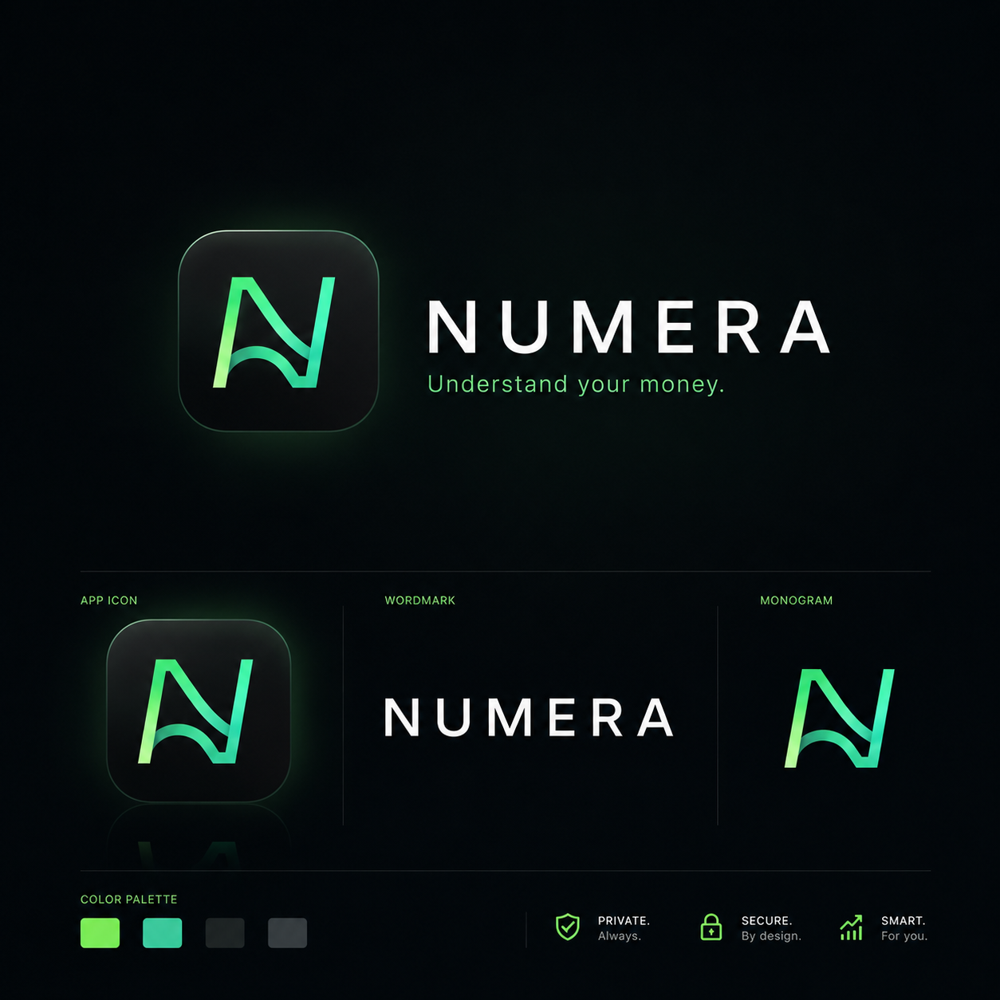
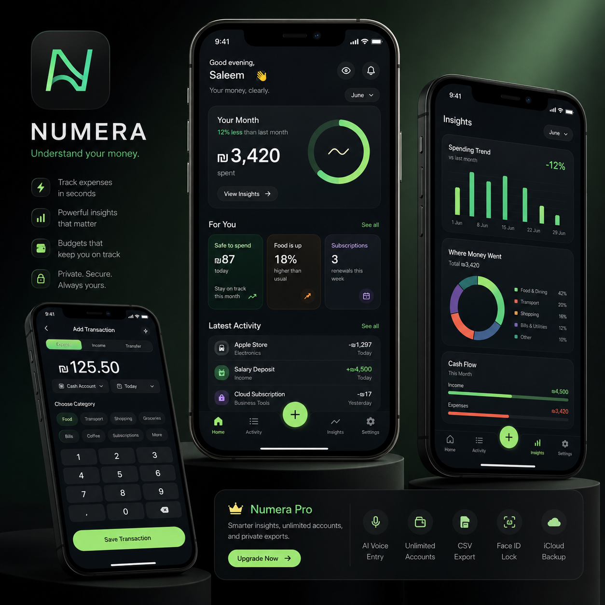

<p align="center">
  
</p>

<h1 align="center">Numera</h1>

<p align="center">
  <strong>Track expenses fast. Understand money clearly. Stay in control — privately.</strong>
</p>

<p align="center">
  A manual-first, premium expense tracker for iOS. SwiftUI · iOS 17+ · Supabase · StoreKit 2.
</p>

<p align="center">
  
  
  
  
  
</p>

<p align="center">
  
</p>

---

## What is Numera?

Numera is **not** a banking app. It's a manual-first expense tracker for people who want to
add expenses in seconds, understand where their money goes, and stay in control — without
handing their financial life to a third party.

The experience borrows from three places at once: **Quanto-style** fast manual tracking,
**Nike-app editorial** personalization ("For You" cards, story-like summaries), and
**Apple-native** SwiftUI polish (large titles, native sheets, Liquid Glass, haptics, SF Symbols).

The look is **dark-first** with a "Deep-Sea" charcoal-blue palette and a single **Mint-Volt**
accent reserved for income, growth, and primary actions.

## Features

- **Home** — a personalized dashboard: the month's spend with a budget ring, a "For You"
  row (safe-to-spend, spend anomalies, upcoming subscriptions), and latest activity.
- **Activity** — the full transaction feed with month switching, search, and swipe actions.
- **Add Transaction** — a fast, one-handed keypad flow (expense / income / transfer) with
  category chips, account, date, and mandatory haptics on every tap.
- **Insights** — native Swift Charts: spending trend vs. last month, a category donut, and
  cash-flow bars, with tap-to-select and selectable date ranges.
- **Budget** — an overall monthly budget plus optional per-category budgets and progress.
- **Settings** — accounts, user-editable categories (emoji / color / kind / order),
  currency, month-start day, reminders, recurring rules, CSV import/export, and account deletion.
- **First-run onboarding** — a once-only, ten-step setup (currency → month cycle → first
  account → categories → first transaction → optional reminder → non-blocking Pro preview)
  that gets a new user to value before the tabs ever appear.
- **Privacy mode** — hide balances by blurring monospaced digits while keeping layout intact.

### Numera Pro (StoreKit 2)

Monthly / yearly (with a 14-day trial) / lifetime. Pro unlocks **budgeting**,
**recurring transactions**, and **CSV export**. Entitlements are tracked on-device by
`PremiumManager`, with a local StoreKit configuration for testing without App Store Connect.

## Architecture

| Layer | Choice |
|---|---|
| UI | SwiftUI, `NavigationStack` per tab, native `.sheet` / `.fullScreenCover` |
| Language | Swift 5.9, `@Observable` models |
| Charts | Native **Swift Charts** |
| Design | SF Pro Rounded app-wide, 8pt spacing rhythm, continuous-curvature cards, Liquid Glass (`.glassEffect`) on iOS 26 with graceful fallback to iOS 17 |
| Project | Generated by **XcodeGen** from [`project.yml`](project.yml) — no `.xcodeproj` in the repo |
| Backend | **Supabase** — Auth (email/password + Sign in with Apple) and Postgres with Row-Level Security |
| Monetization | **StoreKit 2** (`PremiumManager`) |
| CI/CD | GitHub Actions (compile-check) + **Fastlane / Match** → TestFlight; Xcode Cloud `ci_scripts/` |

### Project structure

```text
Numera/
  App/             NumeraApp, ContentView, tab routing, AppInfo, SupabaseConfig
  DesignSystem/    AppColors, AppTypography, AppSpacing
  Components/      NumeraCard, MoneyText, PrimaryButton, TransactionRow, Charts/, LiquidGlass…
  Features/
    Home/  Activity/  AddTransaction/  Insights/  Budget/
    Settings/  Onboarding/  Auth/  Premium/  Launch/
  Models/          Account, Transaction, Budget, UserCategory, RecurringRule, CurrencyInfo, MockData
  Services/        DataStore(+CSV/+Recurring/+Aggregates), SupabaseManager, AuthManager,
                   PremiumManager, AppSettings, ReminderScheduler, MoneyFormatter, Haptics, Period
  Resources/       Assets.xcassets, Info.plist, Numera.storekit

supabase/          SQL migrations (schema v2) + delete-account edge function
design-assets/     App-icon set + design handoff package
docs/              CI/CD, GitHub workflow, and changelog guides
fastlane/          Fastfile, Appfile, Matchfile
ci_scripts/        Xcode Cloud hooks
```

### Data model (Supabase, schema v2)

`profiles` · `categories` · `accounts` · `transactions` · `budgets` — every table has RLS so
users only ever touch their own rows. Categories are user-editable (emoji, color, expense/income
kind, sort order); accounts carry an emoji and a **starting** balance (current balance is computed
as `starting + income − expenses`); transactions reference categories and accounts by FK with a
denormalized `account_name` fallback so history survives deletion. See
[`supabase/README.md`](supabase/README.md) for the full schema, triggers, and sign-up seeding.

## Getting started

### Prerequisites

- macOS with **Xcode 26** (the Xcode 26 SDK is required for real Liquid Glass; the app still
  runs down to **iOS 17**)
- [XcodeGen](https://github.com/yonaskolb/XcodeGen) — `brew install xcodegen`
- A [Supabase](https://supabase.com) project (free tier is fine)

### 1. Configure Supabase

Set your project's URL and **anon** (public) key in `Numera/App/SupabaseConfig.swift`:

```swift
enum SupabaseConfig {
    static let projectURL = "https://<your-project>.supabase.co"
    static let anonKey    = "<your-anon-key>"
}
```

> The **anon** key is a public client key protected by Row-Level Security and is safe to ship
> in an app. **Never** put the `service_role` key here — it stays server-side only (the
> `delete-account` edge function reads it from the environment).

### 2. Apply the database migrations

In the Supabase dashboard, run each file in `supabase/migrations/` in order via
**SQL Editor → New query** (they depend on one another). See
[`supabase/README.md`](supabase/README.md).

### 3. Generate the Xcode project and run

```bash
xcodegen generate
open Numera.xcodeproj
```

Select the **Numera** scheme and run on an iOS 17+ simulator or device. Local StoreKit testing
uses the bundled `Numera/Resources/Numera.storekit` — no App Store Connect needed to exercise
the paywall.

## Privacy

Privacy is treated as a core feature, not an afterthought:

- **Local-first** UX; financial data is not sent to third-party analytics.
- **Row-Level Security** on every Supabase table — no data leaks between accounts.
- **Privacy mode** blurs amounts on demand; Face ID lock is on the roadmap.
- No secrets in the repo: `.env` files, signing certs, `service_role` keys, and API keys are
  git-ignored.

## Documentation

| Doc | What's in it |
|---|---|
| [`design/luminous_ledger/DESIGN.md`](design/luminous_ledger/DESIGN.md) | Full design tokens — colors, typography, spacing, shapes |
| [`CHANGELOG.md`](CHANGELOG.md) | Every meaningful change, newest first |
| [`HANDOFF.md`](HANDOFF.md) | Session-by-session status for the next developer |
| [`supabase/README.md`](supabase/README.md) | Database schema, migrations, RLS, and seeding |
| [`docs/`](docs) | CI/CD setup, GitHub workflow, and changelog guide |

## Roadmap

- Face ID app lock
- iCloud / cross-device sync polish
- AI voice entry ("add 12 dollars, coffee")
- Richer recurring-transaction automation
- Widgets and Shortcuts


## License

No license is currently granted — all rights reserved. Please open an issue if you'd like to use
any part of this.

---

<p align="center"><sub>Numera — <em>Understand your money.</em></sub></p>
